# Todey Task Management App 👋


[](#)

 


A Task Management App built with Flutter Made with 💙

# Flutter Version
Flutter 1.22.4


# 💻 Requirements

- Any Operating System (ie. MacOS X, Linux, Windows)
- Any IDE with Flutter SDK installed (ie. IntelliJ, Android Studio, VSCode etc)
- A little knowledge of Dart and Flutter

# Screenshots

 | 1 | 2|
|------|-------|
|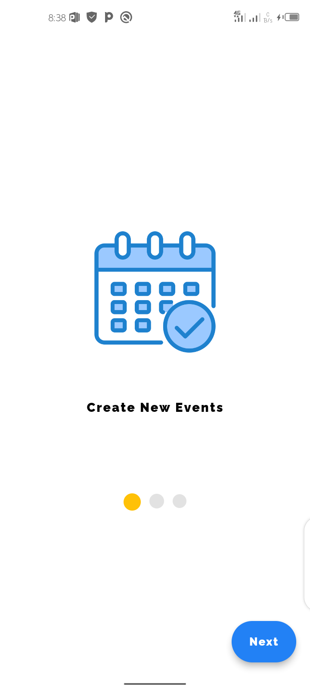|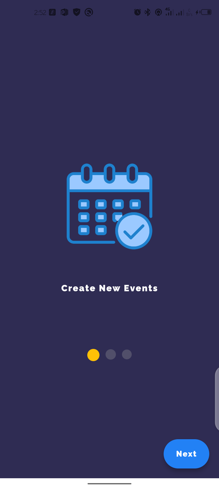|


 | 3 | 4|
|------|-------|
|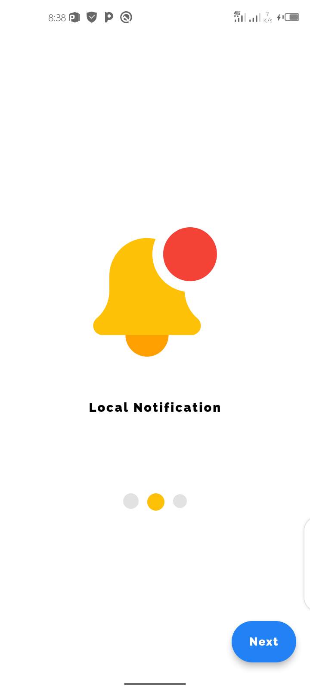|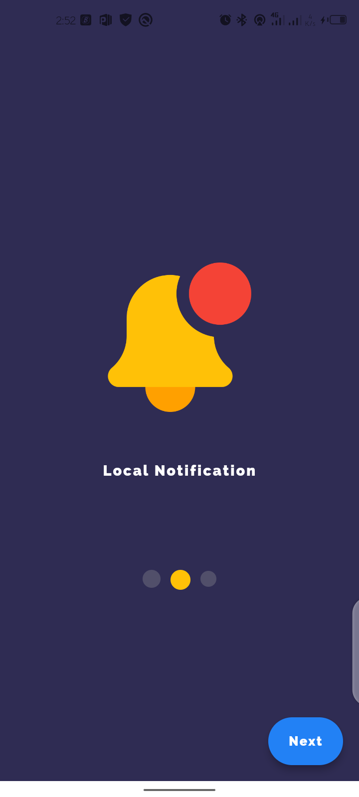|


 | 5 | 6|
|------|-------|
|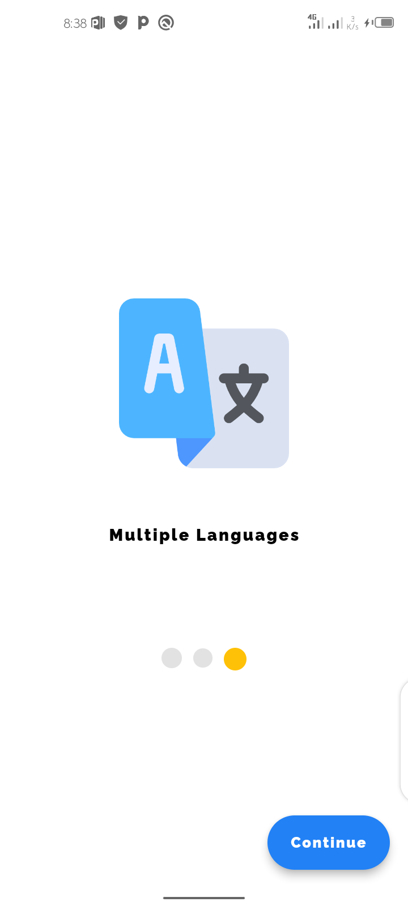|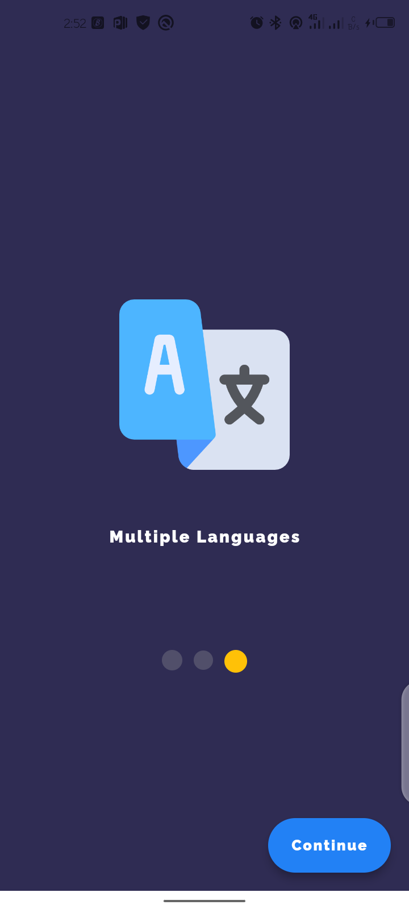|


 | 7 | 8|
|------|-------|
|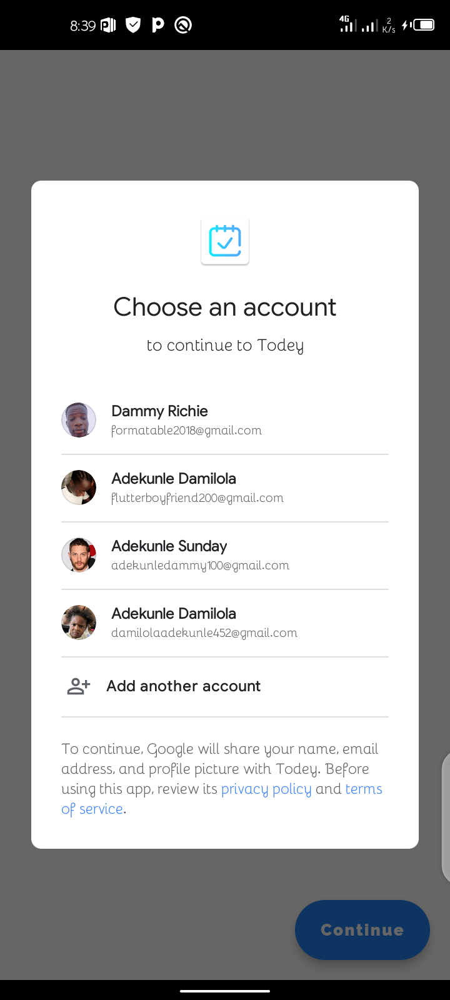|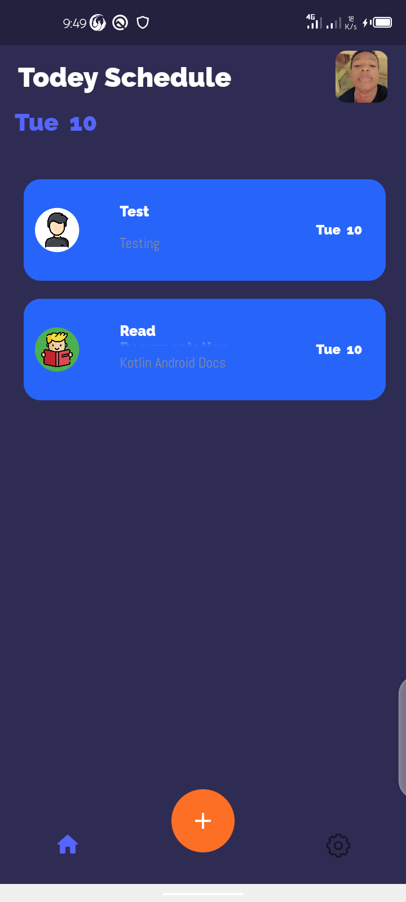|

 | 9 | 10|
|------|-------|
|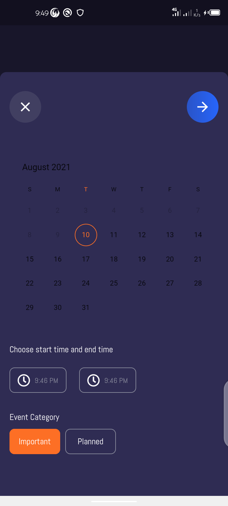||


 | 11 | 12|
|------|-------|
||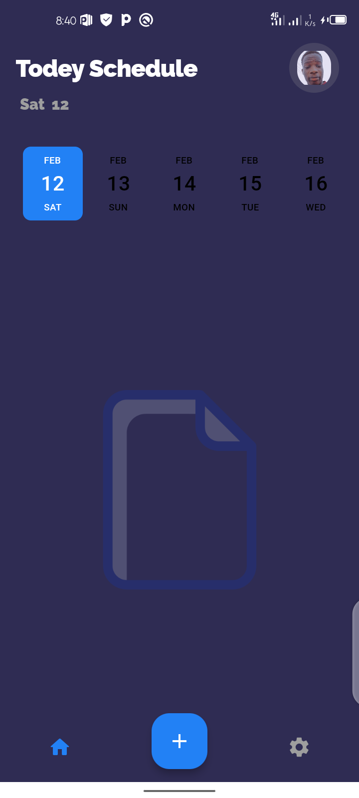|

 | 13 | 14|
|------|-------|
|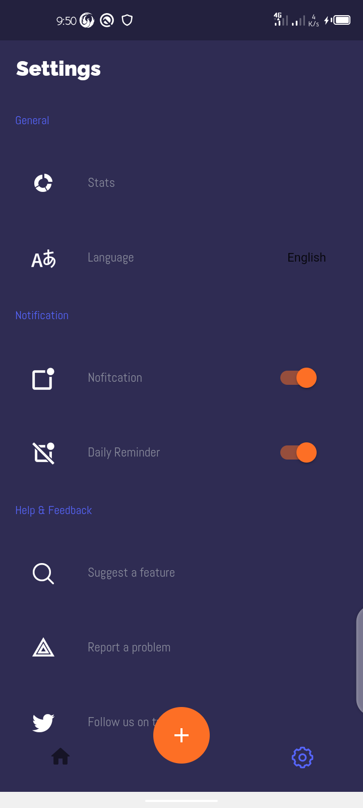|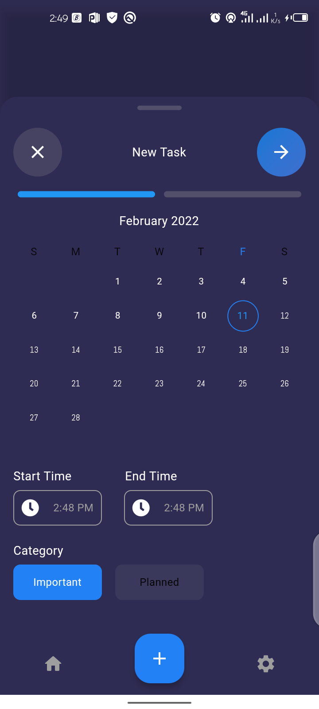|

 | 15 | 16|
|------|-------|
|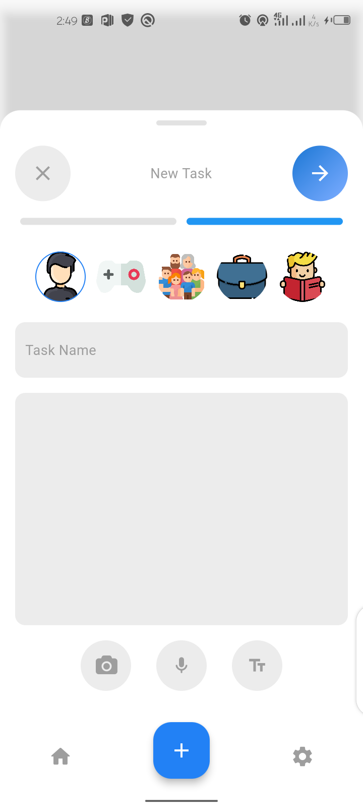|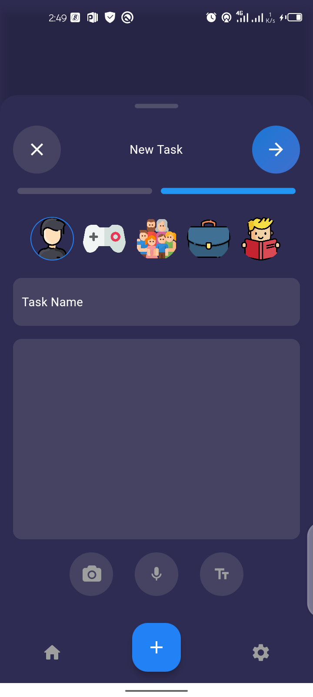|

 | 17 | 18|
|------|-------|
||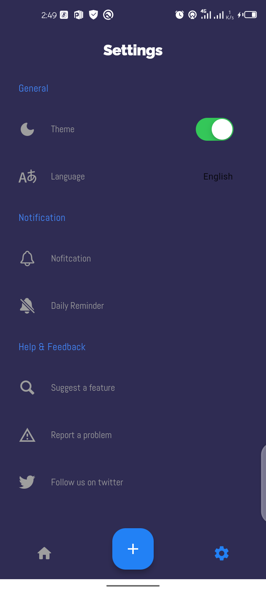|

# Command
### Install dependencies

```sh
flutter pub get
```

### Run application

```sh
flutter emulators --launch <emulator_name>
flutter run
```

### Build

```sh
flutter build apk
```

# Plugins

- [firebase_core](https://pub.dev/packages/firebase_core) 
- [firebase_auth](https://pub.dev/packages/firebase_auth) 
- [google_sign_in](https://pub.dev/packages/google_sign_in) 
- [sqflite](https://pub.dev/packages/sqflite) 
- [path_provider](https://pub.dev/packages/path_provider) 
- [shared_preferences](https://pub.dev/packages/shared_preferences) 
- [fl_chart](https://pub.dev/packages/fl_chart) 
- [flutter_local_notifications](https://pub.dev/packages/flutter_local_notifications) 
- [syncfusion_flutter_datepicker](https://pub.dev/packages/syncfusion_flutter_datepicker)
- [feedback](https://pub.dev/packages/feedback) 
- [cached_network_image](https://pub.dev/packages/cached_network_image) 
- [url_launcher](https://pub.dev/packages/url_launcher)
- [flutter_phoenix](https://pub.dev/packages/flutter_phoenix)
- [date_picker_timeline](https://pub.dev/packages/date_picker_timeline)
- [fluttericon](https://pub.dev/packages/fluttericon)
- [fluttertoast](https://pub.dev/packages/fluttertoast)


# Features
- Light/Dark Theme
- Create Task 
- Delete Task
- Read Task
- Google Authentication
- Feedback
- Suggest Feature
- Multi-Language Localization (English, French, Portuguese)
- Local Notification
- Follow on Twitter
- Dismissible Slider 
- Local Notification

# Coming Soon
- Attachment (image, audio, doc/pdf)
- Animated avatar
- logout 
- save theme state
- save language state
- daily reminder 
- dismissible to update
- charts for task 
- create and display image task 
- create and display audio task 
- Daily Notification


## Author

👤 **Dammy Richie**

* Github: [@Dammy Richie](https://github.com/ichie2)
 

## Contributors

👤 **Dammy Richie**


